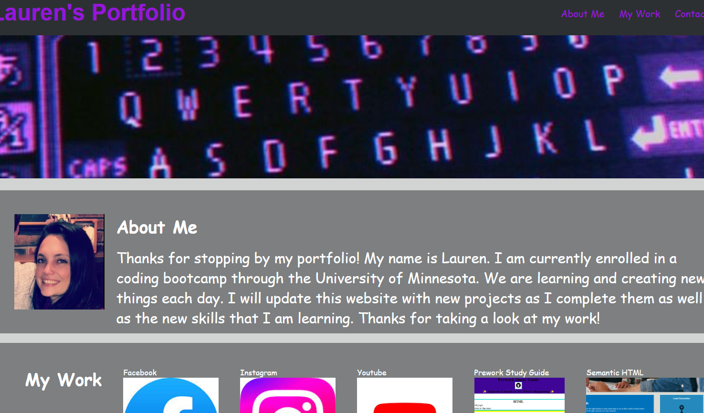

# Student Portfolio Site

## Activity

- I have created a sample portfolio for myself to showcase some of my work. 
- I created an about me section, a work section, and a section on how to contact me.
- Links have been created to take you to the sample work.
- You can use the nav bar at the top to navigate to different parts of the page.

## User Instructions

- Click the links to look at sample work.
- Click the buttons to contact me in different ways.
- Click the nav links to navigate to different parts of the page.

## Screenshot

- Here is a screenshot of the working webpage.

## Working Code

- Here is a link to a working version of my code:
[portfolio-site](https://laurbaur024.github.io/portfolio-site/)